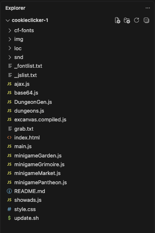

# So, you want to make a Cookie Clicker mod?

This is a guide about how to make a Cookie Clicker mod.

To begin, you will need the following prerequisite knowledge (it's really simple!):
1. Basic knowledge of programming or JavaScript
2. Basic knowledge of HTML and CSS
3. Basic knowledge of Cookie Clicker, at least on the gameplay level (this guide will cover how to navigate the codebase!)

This guide assumes that you are modding on a browser with the browser version of the game. Some steps are slightly different on Steam, but it is highly recommended to mod on the browser version instead of the Steam version as it offers many conveniences that the Steam version does not have; you can always transfer it over to Steam, it does not require a lot of effort as both versions use the exact same language and even the same codebase; the Steam version just has an additional file that implements some Steam-specific stuff.

## 1. Getting Started
This section assumes that you do not know much about JavaScript. Skip if you already know the language.

### 1.1. Running scripts
The simplest way to run a cookie clicker mod is to simply paste the mod's code in the developer console of your browser. The developer console is a tool built into your browser that allows you to run JavaScript code - you should use a search engine or AI with your OS and browser used to find out how to open it.

If you open the developer console while on a tab of Cookie Clicker, you will be able to change the game by typing certain commands. This is often framed as useful "hacking" commands, like the following:
```js
Game.cookies += 1e+63;
```
Which makes you gain 1 vigintillion cookies immediately. This is however not the focus of this document, and you will not be using the developer console to load your mods (as it is very inconvenient); but this is a very useful tool to keep in mind for testing your mod.

### 1.2. Local development
This guide assumes that you already know some programming. If not, you should learn some JavaScript so that you can follow along.

Now, if you do not already have one, you should download an IDE, which will provide a code editor and a way to test your mod easily. You can use whatever you want but this guide will use Visual Studio Code (VS Code) for its popularity. If you use another IDE, you would need to discover some things yourself.

To mod the game you first need a copy of the game's code. You can find a copy of the code on the [OZH's GitHub](https://github.com/ozh/cookieclicker). Git clone it onto your computer with the "Clone Git repository" option. The codebase should look something like this:


The important files are:
1. `main.js`: Contains the vast majority of the game's logic apart from the minigames.
2. `index.html`: The entrypoint, containing the baseline HTML for the game.
3. `style.css`: The CSS for the game.
In addition, all files starting with `minigame` are minigame-related code (e.g. `minigameGarden.js`) and may be useful if you want to interface with them or make your own minigames.

### 1.3. Loading your mod
No great mod is made without testing. To test your mod, you must at least run the game. While you can do this by directly opening `index.html`, the game does not update as you edit the code, and you will need to refresh the page each time you make a change (and you will run into tons of cache related headaches). A better way to do this is via the `live server` extension for VS Code. Simply install it and you can use the "Go live" button at bottom-right to open a copy of the game, and it has the benefit that it will automatically reload when you make any changes.

Once you have your game running, you can turn this vanilla copy of the game into a modded one with your mod on it. Follow:
1. Create a file ending in `.js`. This file will contain your mod's code. For testing purposes, put this line of code into your file:
```js
console.log('Hello, world!');
```
2. Let's say you named it `mod.js`. Put the following line of code at the bottom of `main.js`:
```js
var PRESETMODS = ['mod.js'];
```
3. Save `main.js`.
4. Go live, making sure the page is refreshed.
5. Open the developer console. You should see `Hello, world!`. If so, you have successfully loaded your mod!

This is **not** how you will load mods in the final game, but it is a good way to test your mod. The guide will elaborate on how mods are actually loaded later on.

### 1.4. Learning JavaScript
Here are some helpful resources for learning JavaScript:
- [W3Schools' JavaScript tutorial](https://www.w3schools.com/js/default.asp)
- [Mozilla's JavaScript documentation](https://developer.mozilla.org/en-US/docs/Web/JavaScript)
- [Codecademy's JavaScript course](https://www.codecademy.com/learn/introduction-to-javascript)

## 2, Programming and CC

## 2.1. The CC source code
Cookie Clicker uses an almost entirely monolithic structure (all the code in the same file), mostly contained within `main.js`, attached under one object called `Game`. 

The game provides a simplistic modding interface with two parts:
- `Game.registerMod`: call this function with the proper inputs to register the mod and use the modding interface. This is paramount for a steam mod but is not necessarily required for a browser-only mod (but highly recommended!)
- `Game.registerHook`: offers a slight variety of hooks to allow your own functions to be called when the game does certain specific things. Useful hooks include: `'logic'`, `'check'`, `'reset'`, though there are more.
For more details, check line **1,000** of `main.js`. (yes, it is not rounded) The modding API is very bare bnoes and anything else will require injections or wrapping (see 2.2) - for anything decent, the main purpose of the `Game.registerHook` is to put a place to store your mod data.

Other than the modding API, the game's codebase is not very well documented; and the best way to learn how to interface with the game functions is to read the codebase and try to figure out how to do things yourself. Here are some tips to do so:
- Use Ctrl+F: Opens a search bar. Whenever you see an unknown function or variable, search it up. You can also use the "Go to definition" utility by right clicking on the variable, though due to JavaScript's volatile nature, it may not always work. An extension like Naive Definitions may help with this.
- Use the developer console to test things out. It is genuinely the fastest way to interface with the game.
- When trying to link an in-game element to code, search for its content, element ID, or class name. 
Important files include `main.js` and anything starting with `minigame` (e.g. `minigameGarden.js`).

## 2.2. Injections vs wrapping
You can't always do everything with just your own code and hooks provided by the game. Sometimes you need to inject your own code into the game's codebase. There are two main ways to do this:

### 2.2.1. Injections
Injections are the most capable way to modify the game, it can inject code and it can also modify existing code, but it isn't always the best.

`eval` is a function that lets you execute code from a string. Let's say you want to inject into `Game.CalculateGains` to make the first kitten twice as powerful. One of the most popular ways to do this is:
```js
// Game.CalculateGains.toString() gets its function definition as written in the game files.
eval('Game.CalculateGains='+Game.CalculateGains.toString().replace(`if (Game.Has('Kitten helpers')) catMult*=(1+Game.milkProgress*0.1*milkMult);`, `if (Game.Has('Kitten helpers')) catMult*=(1+Game.milkProgress*0.2*milkMult);`));
```
You can do injections similarly by just copying code to identify the place you want to inject at, then append your own code to the end of the vanilla code. 

An alternate and lesser-known way to inject is with the `Function` constructor. The `Function` constructor allows you to create a function from a string. You can inject like so:
```js
Game.CalculateGains = new Function('return ' + Game.CalculateGains.toString().replace(`if (Game.Has('Kitten helpers')) catMult*=(1+Game.milkProgress*0.1*milkMult);`, `if (Game.Has('Kitten helpers')) catMult*=(1+Game.milkProgress*0.2*milkMult);`) + ';')();
// Notice the () at the end of the line - it calls the function created by the Function constructor immediately.
```
This has the advantage of being situated in the global scope, which is better for bundlers (if you don't know what that is, disregard it).

Injections will destroy the closure of the original function. That means if you run the following code and try to inject into `Game.test2`:
```js
function test() {
    const hello = 'world';
    Game.test2 = function() {
        console.log(hello);
    }
}
test();

// Now modify Game.test2
Game.test2 = new Function('return '+Game.test2.toString()+';')();
```
Calling the modified `Game.test2` will get `undefined`, not `"world"`. To fix this, you will need to declare the same variable in the same space before you did the injection. An example would be (using the Function constructor method):
```js
Game.test2 = new Function('hello', 'return '+Game.test2.toString()+';')('world');
```

### 2.2.2. Wrapping
Wrapping is a less powerful way to modify the game, but it is also more straightforward. Examine the following code:
```js
Game.mouseCps = function() {
    console.log('Mouse CPS computed!');
}
```
The code assigns a function to the variable `Game.mouseCps` which happens to be a method. When the game tries to call the method `Game.mouseCps`, because you have assigned it to your own function, it will instead call your function and not the game's one, resulting in `Mouse CPS computed!` being logged. If you then store the original function in a variable, you can call it later to restore the original behavior.

Let's say you want to increase your click power by 50%. You can do this by wrapping the vanilla function:
```js
const original = Game.mouseCps;
Game.mouseCps = function() {
    return original() * 1.5;
}
```
If the function requires arguments, you would also need to declare the same arguments in your wrapper and pass them into the original function. Like so:
```js
const original = Game.sayTime;
Game.sayTime = function(time) {
    return original(time) + '!';
}
```
For testing, you can also disregard storing the original function and just copy paste the function definition inside the wrapping function to modify, but this is highly not recommended for production.

Wrapping can do many things, but it is not as powerful as injections. Notice how you can't really modify the first kitten to be twice as powerful here, because you cannot access the inner workings of the original function.

### 2.2.3. Injections vs wrapping
So, which one should you use? It often comes down to preference and the specific use case. I hope that the following comparison table can help you make your choice:

| Aspect | Injections | Wrapping |
| ------ | ------------ | ------------ |
| Capability | Can do virtually anything | Can only inject code to be called at the start or end of functions |
| Safety | Is often considered less safe, as game updates can easily break injections | Harder to break or encounter bugs as behavior is more predictable |
| Compatibility | Less compatible: other mods injecting may cause your injections to falter; you cannot inject a wrapped function | More compatible: you can wrap already wrapped functions or already injected functions |
| Closures & scope | Will destroy the closure of the original function, causing any references to local variables not declared within the function to be undefined or throw errors; need to reconstruct the scope by declaring the same variable outside of it (for `eval`) or pass the variable into the function (for the `Function` constructor) | Will not destroy the closure of the original function, local variables will be preserved (but you cannot access them) |
| Ease of use | More difficult to use | Easier to use |

### 2.3. Other programming notes
At this point you should already know some JavaScript. However, the game is rather janky sometimes, so here are some important details to keep in mind when starting your first mod:

#### 2.3.1. Useful native functions
The game uses several utility functions regularly, which you may find useful in your modding journey. Some of them are especially relevant as functions that output standardized output, allowing parts of your mod to match some base game conventions.

| Function | Description | Input types | Output types |
| -------- | ----------- | ----------- | ------------ |
| `l(id)`  | Equivalent to `document.getElementById`. | `string` | `HTMLElement` |
| `Beautify(value, precision)` | Parses a number by adding commas, and adds a postfix (e.g. `1000000000` => `1 billion`) whenever applicable. The `precision` argument specifies how much to round. | `number`, `number` | `string` |
| `SimpleBeautify(value)` | Like `Beautify`, but only adds commas to the input. | `number` | `string` | 
| `choose(array)` | Returns one random element within the array. | `any[]` | `any` |
| `Game.sayTime(time, detail)` | Takes in a time in amount of frames (default 30 frames/second) and returns a human-readable string. The `detail` skips days when >1, hours when >2, minutes when >3 and seconds when >4, skips none when it is `-1`. | `number`, `-1 \| 2 \| 3 \| 4 \| 5` | `string` |
| `randomFloor(number)` | Randomly floors or ceils the input based on how close the input is to its floored value. For instance, `randomFloor(2.3)` has a 0.3 (30%) chance to return 2 and a 0.7 (70%) chance to return 3. | `number` | `number` |
| `loc(string, placeholders)` | See the Localization section further down this page. | `string`, `undefined \| Array` | `string` |

Other base game API includes: `Game.Notify`, `Game.Prompt`, `Game.getTooltip`, `Game.getDynamicTooltip`.

#### 2.3.2. The environment is unreliable
`PRESETMODS` is a very special variable that is used to load mods before the game is ready, in similar fashion to Steam. However, this will not always be the case - very often, your users (mainly people who play on the browser) will find themselves loading your mod after the game is ready, where you will lose any and all benefits from being able to access the game's state pre-load. Even if you decide that you will only mod for Steam, script load timings are not guaranteed to be the same, and you should not rely on them. Always assume that your mod will be loaded at any time.

You can check for whether the game has been completely loaded with the following code: `typeof Game !== 'undefined' && Game && Game.ready`. 

#### 2.3.3. Don't pollute the global namespace
As tempting as it is to write 20 `var` variables at the top of your mod as your state keeping, this is not a great idea - it increases the chance of namespace collisions from different mods and does not really make it easier to keep track of your state. Instead, you should use an object and put all your state in it. There are two good ways to do this:
1. Put all of your state and methods inside the `Game.registerMod` mod object. The `this` keyword is bound to the entire mod object as long as you don't involve event listeners or other async methods. This way you do not have to create an object yourself, and you can access your state and methods from anywhere in the game. You can then attach this mod object to the global scope with something like `window.myMod = this` in `init` to bypass the event listener problem.
2. Create a new object on the global scope and put all of your state and methods in it. You can then use `Game.registerMod` to register your mod separately, but only interface with your new object. This method is event-listener-proof (as all references use the global object instead of an ephermeal `this`), but you have to manage two parallel systems at once (the global object and the mod object).

### 2.3.4. Saving format
Saving and loading is one of the most difficult parts of making a mod as the process is highly async, and a bad system will make continued development exceedingly difficult as you go on. 

In my (the guide creator) opinion the best method for saving is simply using `JSON.stringify` and `JSON.parse` with selective fields; and only compress highly repetitive fields that are unlikely to change. While this may seem like using a lot of storage space, the following reasons may persuade you otherwise:
1. **Extendability**: If you need to add a new field, you can simply add it to the save file and it will be automatically loaded. You don't need to count the amount of entries and put new magic numbers into the load function, it just works. 
2. **Ease of debugging**: If you ever need to fix a broken save or mod new values into your save for testing, you can just base64 decode the save and change it directly by looking at the variable name; you don't need to count any magic numbers and worry about messing up.
3. As long as it is not too excessive, this doesn't achieve much of anything as someone who could load mods probably don't need to save that few kB. If it ends up being very excessive you can always compress the specific fields that is taking up a lot of space. 

Note that the load function will be called immediately after your init function.

## 2.4 Mod loading
How your user loads your mod depends on the platform and tools used. Here is a simple table detailing the methods:

| Platform | Method name | Description |
| ----- | ----- | ----------------- |
| Steam | Steam Workshop | Refer to the `README.txt` found in the `mods/` folder of your copy. |
| Browser | Console | Given a short script containing `Game.LoadMod`, paste it into the developer console and press enter. A link is needed. |
| Browser | Bookmarklet | Given a short script starting with `javascript:` and a `Game.LoadMod` with your mod link, create a bookmark and paste the script into the URL field. |
| Browser | Mod loader extension | Using the Cookie Clicker Mod Manager (CCMM) extension, load the mod with a proper link that will be fed to `Game.LoadMod`. |
| Browser (with mod loader) | Userscripts | Using the Tampermonkey or Greasemonkey extension, define a userscript that either contains a `Game.LoadMod` to the mod, or the mod's code. |

Note that for many of these methods you will need a link to your mod's code. The link needs to have the right MIME header. Two popular ways to serve this file are:
- Github Pages: enable Github Pages on your Github repository and use the link `https://your-name.github.io/your-repo-name/mod-file-name.js`.
- Glander API: (recommended for small unimportant mods only) upload your mod's code onto [pastebin](https://pastebin.com) and get the ID of your paste (present in the URL, like the `WSdRdqx2` of `https://pastebin.com/WSdRdqx2`), then append the ID to `https://glander.club/asjs/`. 

For the console and bookmarklet methods, you can use the same code. A working snippet is 
```js
javascript:(function(){Game.LoadMod('https://example.com');})()
```
(replace `https://example.com` with your mod's link)

## 2.5. Localization
If you are not planning on your mods becoming translated across multiple languages **ever**, then you can ignore this part. However, if you plan on localizing your mods at any point in the future, it's best to start the process now so you don't have to do a bunch of menial work later. 

### 2.5.1 Localization mechanics
The game applies localization via the `loc` function. It takes in a string that includes placeholder tokens to be replaced (like `%1`), and the actual values to replace the placeholder tokens in an array as its second argument, and returns the localized string. The function looks up the corresponding string in a localization table, and if it doesn't find it, it returns the original string (and will not replace any placeholder tokens!). Therefore, if you were to use the localization system, it is imperative that all strings that are passed to the function are present in the localization table.

The localization table is a JS object with the following structure:
```js
{
    "Text 1": "Localized text 1",
    "Text 2": "Localized text 2",
    "Text 3 with a custom %1": "Localized text 3 with a custom %1",
    ...
}
```
It is passed into the function `AddLanguage` alongside the target language. If you specify a preexisting language the strings will be added to that language's table. 

You can get the current language with the expression `(localStorageGet('CookieClickerLang') ?? 'EN')`. If you register a language as a mod make sure that the fourth argument is `true`.

## 3. Resources
You can also install type definitions for the base game via `npm install @types/cookieclicker` (highly recommended). There are also premade types files for the game's API in this repository's `types/` folder. There's one for `2.053` (steam) and one for `2.058` (web). It comes from [DefinitelyTyped](https://github.com/DefinitelyTyped/DefinitelyTyped/blob/master/types/cookieclicker/index.d.ts). 

For any further questions, you can try asking the [Cookie Clicker Discord](https://discord.gg/cookie) in the **#dashnet-modding** channel.

You can see some examples of basic mods in the `examples/` folder.
(ill add more later)

Guide made by CursedSliver.